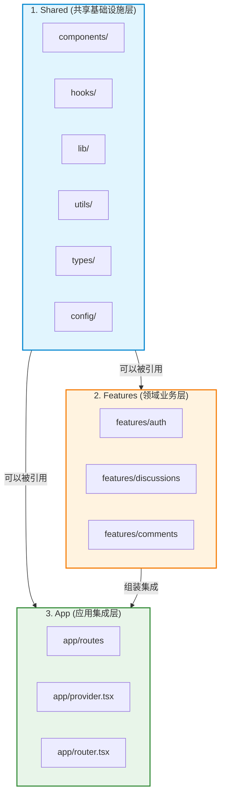

# 🗄️ 项目结构与依赖治理规范 (Project Structure & Dependency Rules)

Bulletproof React 的核心思想在于**以业务特性（Feature-based）为中心组织代码**，并建立**严格的单向依赖边界**。本参考文档详述各目录职责、Feature 内部组织规范以及通过工具硬性约束架构边界的具体实践。

---

## 一、全局目录拓扑

现代 React 应用绝大多数源码生活在 `src` 目录下，整体结构如下：

```text
src/
├── app/                  # 应用集成层：路由、全局 Providers、顶级布局与入口
│   ├── routes/           # 路由页面树（如 app/routes/app/discussions.tsx）
│   ├── app.tsx           # 应用根组件
│   ├── provider.tsx      # 全局 Context/Provider 组合器（React Query, Auth, Theme 等）
│   └── router.tsx        # 路由实例配置（Data Router / createBrowserRouter）
├── assets/               # 全局静态资源（图片、SVG、字体等）
├── components/           # 跨业务共享的通用 UI 组件
│   ├── ui/               # 基础设计系统原子组件（Button, Dialog, Input, Dropdown 等）
│   └── layouts/          # 全局通用布局骨架（Header, Sidebar, ContentLayout 等）
├── config/               # 全局环境配置、路由路径常量映射（env.ts, paths.ts）
├── features/             # 业务领域功能模块（所有核心业务代码聚集地）
│   ├── auth/             # 认证相关业务
│   ├── discussions/      # 讨论区相关业务
│   ├── comments/         # 评论相关业务
│   └── users/            # 用户个人中心
├── hooks/                # 跨业务共享的通用自定义 React Hooks（如 useDisclosure, useDebounce）
├── lib/                  # 预先配置好的第三方客户端单例（api-client, react-query 等）
├── stores/               # 全局通用客户端状态 Store（轻量级 Zustand store）
├── testing/              # 测试通用工具、MSW 模拟服务器与 Mock 数据库定义
├── types/                # 跨业务共享的基础 TypeScript 类型声明（api.ts 等）
└── utils/                # 跨业务共享的通用纯函数工具库（format-date.ts 等）
```

---

## 二、单向依赖流 (Unidirectional Dependency Flow)

为了保证代码库的可预测性与可维护性，代码依赖关系必须**严格自底向上单向流动**：



### 依赖流动原则
1. **Shared 模块最底层**：`components`, `hooks`, `lib`, `utils`, `types`, `config` 只能引用其自身或同级共享模块，**绝对严禁反向 import `features` 或 `app`**。
2. **Features 只能引用 Shared**：`features` 内部可以自由引用 `shared` 下的通用模块，但**绝对禁止引用 `app`**。
3. **App 位于最顶层**：`app` 作为装配层，负责组装各个 `features` 与 `shared` 模块形成完整的系统页面。

---

## 三、Feature 模块内部组织规范

每个 Feature 对应一个独立的业务领域（Domain）。Feature 内部应尽可能**自包含（Self-Contained）**：

```text
src/features/discussions/
├── api/                  # 该业务专用的 API 请求定义与 React Query Hooks
│   ├── get-discussions.ts
│   ├── get-discussion.ts
│   ├── create-discussion.ts
│   ├── update-discussion.ts
│   └── delete-discussion.ts
├── components/           # 该业务专用的 UI 组件
│   ├── discussions-list.tsx
│   ├── discussion-view.tsx
│   ├── create-discussion.tsx
│   └── update-discussion.tsx
├── hooks/                # 该业务专用的 React Hooks（可选）
├── stores/               # 该业务专用的本地 Zustand Store（可选）
├── types/                # 该业务专用的领域 TypeScript 类型（可选）
└── utils/                # 该业务专用的领域计算逻辑（可选）
```

### 组织要点：
- **按需创建**：不要在 Feature 里机械式建立所有空目录！如果该功能没有独立的 Store 或 Hooks，就不要建 `stores/` 或 `hooks/`。
- **避免 Barrel 文件（index.ts）**：过去常在 Feature 根部建 `index.ts` 导出所有内容，这会导致打包器难以做 Tree-shaking，且极易引发循环依赖。推荐**直接从具体文件导入**：
  ```tsx
  // ✅ 推荐：直接引入具体文件
  import { DiscussionsList } from '@/features/discussions/components/discussions-list';
  import { useDiscussions } from '@/features/discussions/api/get-discussions';

  // ❌ 避免：全局桶文件
  // import { DiscussionsList, useDiscussions } from '@/features/discussions';
  ```

---

## 四、严禁跨 Feature 引用与替代方案

### 为什么禁止跨 Feature 引用？
一旦允许 `features/discussions` 直接 import `features/comments` 的组件或 Hook，两个 Feature 就会形成隐式强耦合，导致：
- 无法独立测试或重构单个 Feature。
- 极易引发模块间的循环依赖（Circular Dependencies）。
- 牵一发而动全身，架构演变成典型的“分布式大泥球”。

### 正确的跨 Feature 协作方式：在 App 层组装
跨 Feature 的组合必须上浮到 `src/app/routes` 页面层或通用布局中完成：

```tsx
// src/app/routes/app/discussions/discussion.tsx
// ✅ 在 app 路由层同时引入两个独立 feature 并进行组装编排
import { DiscussionView } from '@/features/discussions/components/discussion-view';
import { CommentsList } from '@/features/comments/components/comments-list';

export const DiscussionRoute = ({ discussionId }: { discussionId: string }) => {
  return (
    <div className="space-y-6">
      <DiscussionView discussionId={discussionId} />
      <CommentsList discussionId={discussionId} />
    </div>
  );
};
```

---

## 五、使用 ESLint 强制约束架构边界

口头约定无法防范人为失误，必须使用 `eslint-plugin-import` 的 `import/no-restricted-paths` 规则将上述铁律固化为 CI 门禁：

```javascript
// .eslintrc.cjs 或 eslint.config.js
module.exports = {
  // ... 其他配置
  rules: {
    'import/no-restricted-paths': [
      'error',
      {
        zones: [
          // 1. 禁止跨 Feature 互相引用
          {
            target: './src/features/auth',
            from: './src/features',
            except: ['./auth'],
          },
          {
            target: './src/features/discussions',
            from: './src/features',
            except: ['./discussions'],
          },
          {
            target: './src/features/comments',
            from: './src/features',
            except: ['./comments'],
          },
          {
            target: './src/features/users',
            from: './src/features',
            except: ['./users'],
          },

          // 2. 强制单向流：features 不能引用 app
          {
            target: './src/features',
            from: './src/app',
          },

          // 3. 强制单向流：底层 shared 模块不能反向引用 features 或 app
          {
            target: [
              './src/components',
              './src/hooks',
              './src/lib',
              './src/types',
              './src/utils',
              './src/config',
            ],
            from: ['./src/features', './src/app'],
          },
        ],
      },
    ],
  },
};
```

---

## 六、命名与路径规约

### 1. Kebab-case 全局命名
统一使用短横线隔开（`kebab-case`）命名所有源码文件与文件夹（测试目录 `__tests__` 除外）。可通过 `eslint-plugin-check-file` 校验：

```javascript
'check-file/filename-naming-convention': [
  'error',
  {
    '**/*.{ts,tsx}': 'KEBAB_CASE',
  },
  {
    ignoreMiddleExtensions: true, // 允许 discussion.test.tsx, env.d.ts 等
  },
],
'check-file/folder-naming-convention': [
  'error',
  {
    'src/**/!(__tests__)': 'KEBAB_CASE',
  },
],
```

### 2. 绝对路径别名配置 (`@/*`)
避免深层相对路径（`../../../../`），配置 `@/*` 指向 `./src/*`：

```json
// tsconfig.json
{
  "compilerOptions": {
    "baseUrl": ".",
    "paths": {
      "@/*": ["./src/*"]
    }
  }
}
```

```typescript
// vite.config.ts
import path from 'path';
import { defineConfig } from 'vite';
import react from '@vitejs/plugin-react';

export default defineConfig({
  plugins: [react()],
  resolve: {
    alias: {
      '@': path.resolve(__dirname, './src'),
    },
  },
});
```
