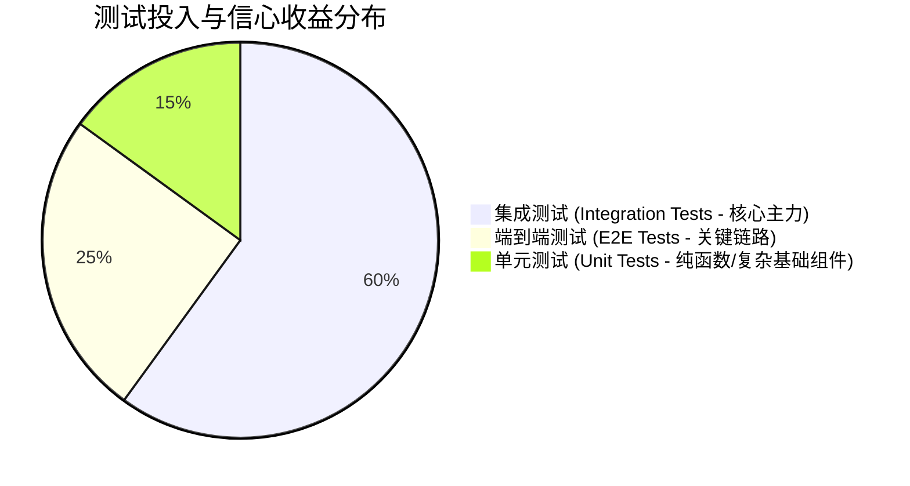

# 🧪 测试策略与质量保障 (Testing Strategy & Quality Gates)

Bulletproof React 提倡**务实、高置信度的测试策略**。核心思想是：“**测试用户看到的行为，而不是内部实现细节**”，并将测试重心放在**集成测试（Integration Tests）**与**端到端冒烟测试（E2E Smoke Tests）**上。

---

## 一、测试金字塔与实用主义重心



1. **单元测试 (Unit Tests)**：
   - 适用于：通用纯函数工具库（`src/utils/*.ts`）、数学计算逻辑、高度复用的基础 UI 原子组件（如 `Button`、`Input`）。
   - 不宜用于：充斥大量 Mock 的业务组件。
2. **集成测试 (Integration Tests - ⭐ 投入产出比最高)**：
   - 适用于：Feature 业务功能闭环与页面路由。
   - 做法：使用 MSW 拦截真实网络请求，渲染完整功能页面，模拟用户真实点击、输入与提交，检验 UI 的最终呈现。
3. **端到端测试 (E2E Tests)**：
   - 适用于：核心商业路径（如：登录 → 新建讨论 → 发布评论 → 登出）。
   - 工具：**Playwright**，在真实浏览器中运行，验证整套前后端系统集成。

---

## 二、测试行为，而非实现细节 (Testing Library 哲学)

### ❌ 错误示范：测试实现细节
- 检查组件内部的某个 `state` 是否等于 `true`。
- 检查内部某个私有方法是否被调用过 1 次。
- 大量使用 `vi.spyOn(axios, 'get')` 返回假对象。这类测试在重构代码（比如换成 TanStack Query 或重命名 state）时会全部报废。

### ✅ 正确示范：像真实用户一样交互
用户看不到组件的 `state`，用户只能看到屏幕上的文字、按钮并进行点击。

---

## 三、集成测试实战模板 (Vitest + Testing Library + MSW)

```tsx
// src/features/discussions/components/__tests__/discussions-list.test.tsx
import { render, screen, waitFor } from '@testing-library/react';
import userEvent from '@testing-library/user-event';
import { describe, it, expect } from 'vitest';
import { AppProvider } from '@/app/provider';
import { DiscussionsList } from '../discussions-list';

// 辅助渲染函数：自动包裹全局 QueryClient 与 Router Providers
const renderWithProviders = (ui: React.ReactElement) => {
  return render(<AppProvider>{ui}</AppProvider>);
};

describe('DiscussionsList 业务集成测试', () => {
  it('应当成功加载并展示讨论列表', async () => {
    renderWithProviders(<DiscussionsList />);

    // 1. 验证 Loading 骨架或加载中状态
    expect(screen.getByRole('progressbar', { hidden: true })).toBeInTheDocument();

    // 2. 验证 MSW 拦截并返回数据后的 UI 呈现（findBy 默认自带 waitFor）
    const discussionTitle = await screen.findByText('Bulletproof React 架构讨论');
    expect(discussionTitle).toBeInTheDocument();
  });

  it('用户点击删除按钮时弹出二次确认窗', async () => {
    const user = userEvent.setup();
    renderWithProviders(<DiscussionsList />);

    // 等待列表加载
    const deleteBtn = await screen.findByRole('button', { name: /删除/i });
    
    // 模拟真实用户点击
    await user.click(deleteBtn);

    // 验证弹窗是否出现
    expect(screen.getByText('确定要永久删除该讨论帖吗？')).toBeInTheDocument();
  });
});
```

---

## 四、Playwright 关键链路 E2E 冒烟测试

```typescript
// e2e/tests/discussions.spec.ts
import { test, expect } from '@playwright/test';

test.describe('讨论区核心用户旅程', () => {
  test('用户能够成功创建一条新讨论', async ({ page }) => {
    // 1. 打开页面
    await page.goto('/app/discussions');

    // 2. 点击创建按钮
    await page.getByRole('button', { name: '新建讨论' }).click();

    // 3. 填写表单
    await page.getByLabel('标题').fill('自动化 E2E 验证标题');
    await page.getByLabel('内容').fill('这是由 Playwright 自动生成的正文内容。');

    // 4. 提交表单
    await page.getByRole('button', { name: '确认发布' }).click();

    // 5. 验证新条目已在列表中渲染
    await expect(page.getByText('自动化 E2E 验证标题')).toBeVisible();
  });
});
```

---

## 五、项目工程质量门禁 (Quality Gates)

在进入代码合并（PR）与持续集成（CI）之前，设立硬性防护防线：

### 1. TypeScript 严格模式 (`tsconfig.json`)
```json
{
  "compilerOptions": {
    "strict": true,
    "noUncheckedIndexedAccess": true,
    "noImplicitAny": true,
    "strictNullChecks": true,
    "forceConsistentCasingInFileNames": true
  }
}
```

### 2. Husky + Lint-staged 提交前拦截
```json
// package.json
{
  "lint-staged": {
    "*.{ts,tsx}": [
      "eslint --fix",
      "prettier --write"
    ],
    "*.{json,md,css}": [
      "prettier --write"
    ]
  }
}
```
在 `.husky/pre-commit` 中执行 `npx lint-staged`，并在 CI 流程中执行全量类型检查 `tsc --noEmit`。
