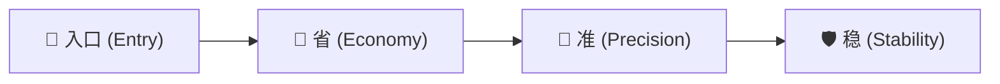
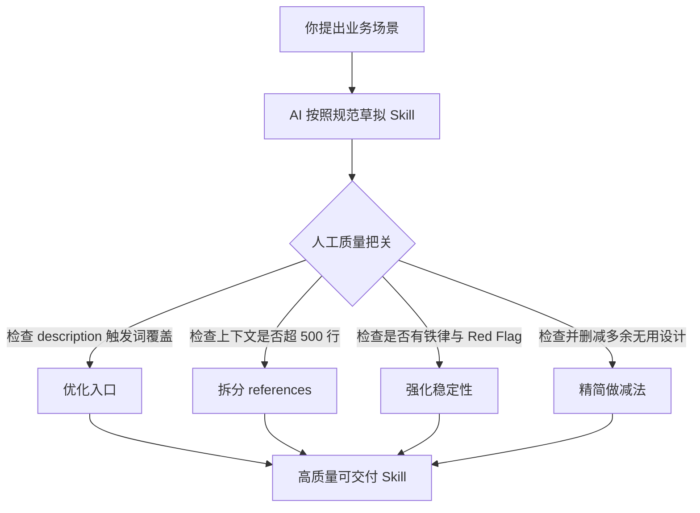

# Skill 开发指南：怎么真正写好一个 Skill？

> **Skill 开发就是新时代的编程。**
> 
> 大家在封装业务流程或者沉淀最佳实践的时候，势必会遇到自己封装 Skill 的场景。本文把这套体系拆开讲透，专注回答一件事：**假如你要写一个 Skill，怎么把它写好？**

---

## 一、先想清楚：你在写的到底是什么？

**Skill 本质上是给 AI 的操作手册（SOP）。**

你给新来的实习生一份模模糊糊的 SOP，和一份结构清晰、重点突出的 SOP，他的产出绝对不在一个水平——大语言模型也是如此。同一个功能，Skill 写得好和写得烂，输出质量、稳定性、一致性完全不在一个档次。

### 为什么写好 Skill 的功夫越来越值钱？
* **跨工具标准**：Anthropic 在 2025 年底把 `SKILL.md` 开放成了跨工具标准，OpenAI 的 Codex 官宣支持，VS Code、Cursor、OpenCode 等陆续跟进。Simon Willison 的判断是 *"Skills 是比 MCP 更大的事"*。你写的 Skill 不绑定任何特定工具，在这上面沉淀的功夫不会白费。
* **低质量 Skill 的代价巨大**：Skill 常驻的元数据会挤占上下文；模糊的描述会导致误触发；臃肿的正文更会把模型的注意力带偏。装一堆低质量 Skill，模型的整体表现反而会断崖式下降。

---

## 二、一个 Skill 的基本构成

一个 Skill 在本质上就是一个**专属目录**，其中唯一必需的文件是 `SKILL.md`。

```
my-skill/
├── SKILL.md                  # 【必需】技能核心名片与操作手册
├── references/               # 【可选】按需查阅的参考资料与深度知识
├── scripts/                  # 【可选】直接调用执行的确定性脚本
└── assets/                   # 【可选】生成产物中引用的模板与静态素材
```

### `SKILL.md` 的结构拆解

```markdown
---
name: code-review
description: "代码审查。当用户说'帮我 review'、'检查代码'、'审查 PR'时使用。"
argument-hint: "[--quick | --strict]"
---

# Code Review

（这里开始是"正文"：告诉模型这个活该怎么干，一步一步的流程、标准、注意事项）
```

1. **Frontmatter（名片区）**：由 `---` 包裹的元数据。
   * `name`（必填）：Skill 唯一标识名。
   * `description`（必填）：一句话介绍。**必须同时说清两件事：这个 Skill 做什么（What），以及何时使用（When to use）**。
   * `argument-hint`（可选）：提示用户调用时可以传入哪些参数。
   * `allowed-tools`（可选）：限制该 Skill 能调用的工具集。
2. **Body（正文区）**：`---` 之下的 Markdown 内容，即给模型看的操作手册本体。

---

## 三、写好一个 Skill 的四大核心原则（入口、省、准、稳）

写好一个 Skill，说到底要回答四个问题：
1. **入口**：怎么被模型准确找到？
2. **省**：怎么不吃垮上下文空间？
3. **准**：怎么让模型真正做对？
4. **稳**：怎么保证每次执行都一样好？



---

### 1. 入口：`description` 决定你的 Skill 能不能被“看见”

> [!NOTE]
> **渐进式披露机制**：Agent 启动时**只把每个 Skill 的名字和描述**装进上下文，正文要等到真正触发后才加载。也就是说，模型在决定“要不要用你这个 Skill”时，手里只有这一句话！

很多人随手写一句 `description: 代码审查工具`，这等于把触发入口堵死了一半。**写得好的 description 是一张触发关键词网。**

#### ❌ 差的写法 vs ✅ 好的写法

```yaml
# ❌ 差的 description (极其容易漏触发)
description: 代码审查工具

# ✅ 好的 description (动词 + 场景 + 同义表达)
description: "代码审查。当用户说'帮我 review'、'检查代码'、'审查 PR'、'看看这段代码有没有问题'时使用。"
```

> [!TIP]
> 优秀的 description 应当覆盖用户习惯使用的自然语言：**核心动词**（plan, build, review, fix, optimize）、**应用场景**（landing page, dashboard, bugfix）以及**常见同义口语**。

---

### 2. 省：上下文是公共资源，别硬塞

Skill 被触发后，正文会完整加载进上下文，与系统提示词、对话历史、用户输入争抢窗口容量。

#### 核心指标与优化策略
* **500 行红线**：Anthropic 官方最佳实践建议 `SKILL.md` 正文控制在 **500 行以内**。
* **按领域拆分到 `references/`**：正文中只写 `Load references/xxx.md`，引导模型在执行到特定步骤时再按需读取。
* **确定性逻辑下沉到 `scripts/`**：反复重写易出错的代码（如 PDF 旋转、AST 解析、格式转换），封装为脚本由模型直接调用。

#### 资源类型的上下文待遇对照

| 资源目录 | 角色定位 | 加载时机 | 上下文消耗 |
| :--- | :--- | :--- | :--- |
| `references/` | 深度知识与标准手册 | 模型执行到特定步骤时**按需读取** | 低（按需占用） |
| `scripts/` | 确定性执行工具 | 模型直接通过命令行**调用执行** | 极低（不加载代码内容） |
| `assets/` | 输出模板与静态素材 | 仅在生成产物时**引用复制** | 零（不进入模型推理） |

> [!TIP]
> **设计模式启发**：“CLI + Skill” 往往远优于臃肿的 MCP。不要一次性向上下文塞入几十个工具定义，提供轻量 CLI 和清晰的命令参考，上下文消耗能少一个数量级。

---

### 3. 准：理解模型的脾气，才知道话该怎么说

模型不缺通用知识，缺的是**注意力的精确引导**与**默认行为的纠偏**。

#### ① 用“该问的问题”代替“该找的答案”

模型特别擅长带着问题找线索。给它一个好问题，它会自己去代码里定位关键点。

* ❌ **模糊指令**：`检查代码是否违反单一职责原则`
* ✅ **问题引导**：`问自己：这个模块有几个不同的修改理由？如果超过一个，就可能违反了单一职责原则。`
* ❌ **模糊指令**：`注意并发安全`
* ✅ **问题引导**：`问自己：两个并发请求同时打到这段代码时，共享状态会发生什么？`

#### ② 点名反面教材，打破模型的“默认模式”

大模型有顽固的默认习惯（例如写前端喜欢蓝紫渐变，写文案动辄 "Learn More"）。**只说“做好一点”是无效的，必须逐条点名列出 Anti-Patterns（反模式清单）**。

#### ③ 立铁律 (Iron Law) 与刹车信号 (Red Flags)

在遇到排查困难或交付压力时，模型很容易本能地“改改试试”走捷径。防范这一问题的最佳方式是**铁律 + 红旗自查**：

> [!IMPORTANT]
> **铁律 (Iron Law)**：
> `NO FIXES WITHOUT ROOT CAUSE INVESTIGATION FIRST`
> （未查清根本原因之前，严禁动手改代码）

```markdown
### 🚩 Red Flags (触发任何一条，强制退回根因分析阶段):
- "I think the problem might be..." （你在凭空猜测，而不是基于事实分析）
- 没搞清 Bug 触发机理就直接修改了代码
- 问题貌似修好了，但无法从原理解释为什么修好了
```

---

### 4. 稳：把流程本身立稳

长流程任务中，模型极易出现**跳过步骤**、**自作主张**或**交付标准模糊**的问题。

#### ① 显式工作流清单与状态标记

在 `SKILL.md` 中提供可打勾的工作流清单，利用标记强制模型步步为营：

```markdown
- [ ] Step 1: 加载用户偏好 ⛔ BLOCKING
- [ ] Step 2: 深入分析输入内容
- [ ] Step 3: 与用户确认实施方案 ⚠️ REQUIRED
- [ ] Step 4: 编码与生成结果
```
* `⚠️ REQUIRED`：标明此步骤绝对不能遗漏。
* `⛔ BLOCKING`：标明未完成前禁止进入后续环节。

#### ② 在关键决策点设立确认门禁 (Gate)

对于有副作用的操作（如大面积重构、数据库修改、删除文件），设置确认节点，强制停下来询问用户确认，防止一错到底。

#### ③ 具体可检查的交付前清单 (Pre-Delivery Checklist)

* ❌ **抽象模糊**：`确保代码可访问性良好`
* ✅ **具体可验**：`所有  标签都具备 alt text 属性；所有表单输入项都具备关联的 <label>`

#### ④ 支持参数系统（提高复用灵活性）

利用 `$ARGUMENTS` 和 `argument-hint` 提供灵活的调用分支：

```bash
/slide-deck content.md --outline-only    # 仅生成大纲
/slide-deck deck/topic/ --regenerate 3   # 仅重做第 3 页
/cover-image article.md --quick          # 跳过交互确认，全自动生成
```

---

## 四、让 AI 帮你写 Skill，你负责把关

这套设计规范不仅可以手动编写，更可以作为**验收标准**让 AI 辅助生成：



> [!WARNING]
> **警惕过度设计**：AI 在编写 Skill 时天然倾向于把所有极端边缘情况、多余参数和无用逻辑全塞进去。**做减法的判断始终是人类的核心职责——每写完一版，问自己“哪些内容可以删去”，而不是“还能加上什么”。**

---

## 五、总结与思维模型

```
       ┌──────────────────────────────────────────────────────────┐
       │                 好 Skill 的三字诀 (省·准·稳)             │
       ├─────────────────┬───────────────────┬────────────────────┤
       │     💾 省       │       🎯 准       │       🛡️ 稳        │
       ├─────────────────┼───────────────────┼────────────────────┤
       │ • 控制在 500 行 │ • description 词网│ • 步骤带 BLOCKING  │
       │ • 知识进 references│ • 启发式问题引导  │ • 决策点设 Gate    │
       │ • 工具进 scripts │ • 铁律与 Red Flags│ • 验收清单具体化   │
       │ • 模板进 assets  │ • 反面清单明确点名│ • 灵活参数支持     │
       └─────────────────┴───────────────────┴────────────────────┘
```

好的 Skill 不是空中楼阁凭空设计出来的，而是**从真实的开发工作流中自然沉淀生长出来的**。理解大语言模型的脾气与运行机制，你就能打造出高效、稳定、可复用的新时代 AI 生产力资产。
